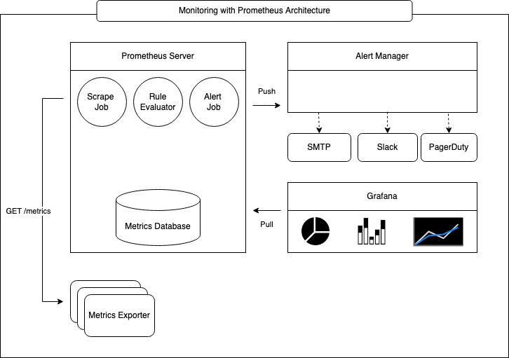
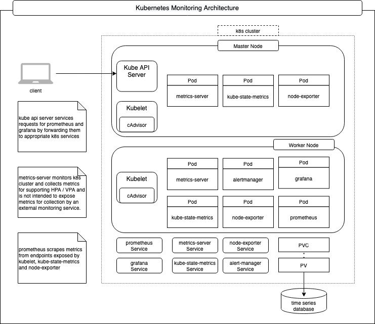
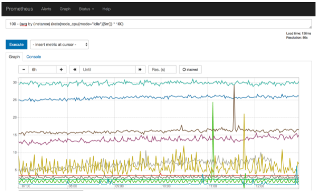
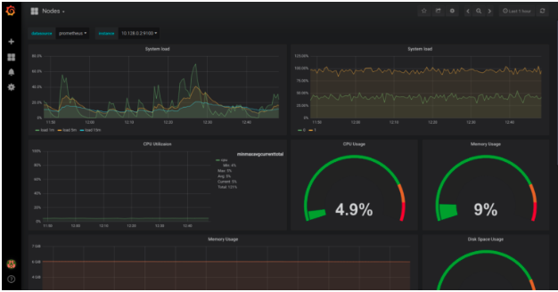

# Kubernetes Monitoring

Kubernetes monitoring involves not only the observability of the components that run in a k8s cluster but also the infrastructure (Nodes that comprise of VMs provisioned on cloud or Bare Metal) on which the cluster is deployed. Monitoring is achieved by generation of metrics, storing them in a time series database and finally consuming them for visualization so that trends  can be analyzed over a period of time for ensuring optimum utilization of the cluster resources as well as alert notifications based on rules configured  by cluster operators / site reliability engineering teams.

Prometheus is the de facto solution for collecting and aggregating metrics and works in conjunction with AlertManager for sending out notifications and Grafana for visualization. Prometheus provides a powerful Query Language (PromQL) that offers the ability to do all sorts of aggregations, analysis, and arithmetic, to better understand the performance of the systems based on metrics collected.



Prometheus provides a UI that can execute the PromQL and depict the results as a graph. This feature is quite useful for prototyping the expressions that can be used for measuring the performance, however, it is still primitive and does not offer the way to save such queries for future and provide more sophisticated dashboards that can show performance for several components being monitored all at once. This is where Grafana comes into picture. Grafana uses the same PromQL to build expressions for metrics query and provides a mechanism to create dashboards to visually display the results.

The picture below illustrates k8s monitoring with Prometheus at a very high level.



This document describes the most commonly used mechanisms that are native to k8s as well as add-on components used to monitor a kubernetes cluster.

## Metrics Generation

Metrics are made available on a well defined HTTP endpoint that is invoked by Prometheus to scrape the metrics.

### Metrics Generation for Kubernetes Components

#### cAdvisor

Git Repo: <https://github.com/google/cadvisor>

Kubernetes exposes metrics in Prometheus format using cAdvisor that runs as an agent in kubelet. The cAdvisor continuously gathers metrics about the state of the Kubernetes resources on each Node.

To get some insights into what metrics are available, let's consider a simple cluster with a master node and a single worker node.

```
$ kubectl get nodes
NAME           STATUS   ROLES    AGE   VERSION
controlplane   Ready    master   65m   v1.18.0
node01         Ready    <none>   64m   v1.18.0
```

The metrics for the worker node can be queried by making a request to the Kube API Server as follows by substituting node-name with name of one of the nodes. Note that only a subset of the result is shown here. For this given instant in time, it took 5s or less for 12 pods to get into a running state, the remaining 4 pods took sometime between 5s to 10s to get into a running state.

```
$ kubectl get --raw /api/v1/nodes/<node-name>/proxy/metrics 
# HELP kubelet_pod_start_duration_seconds [ALPHA] Duration in seconds for a single pod to go from pending to running.
# TYPE kubelet_pod_start_duration_seconds histogram
kubelet_pod_start_duration_seconds_bucket{le="1"} 8
kubelet_pod_start_duration_seconds_bucket{le="5"} 12
kubelet_pod_start_duration_seconds_bucket{le="10"} 16
kubelet_pod_start_duration_seconds_bucket{le="+Inf"} 16
kubelet_pod_start_duration_seconds_sum 39.134549318999994
kubelet_pod_start_duration_seconds_count 16
```

Aggregated cluster metrics are available at /metrics endpoint. Note that only a subset of the result is shown here. Looking at the kubernetes config database etcd, there are 2 nodes in the cluster with a total of 15 pods

```shell
$ kubectl get --raw /metrics 
# HELP etcd_object_counts [ALPHA] Number of stored objects at the time of last check split by kind.
# TYPE etcd_object_counts gauge
etcd_object_counts{resource="apiservices.apiregistration.k8s.io"} 31
etcd_object_counts{resource="certificatesigningrequests.certificates.k8s.io"} 2
etcd_object_counts{resource="clusterrolebindings.rbac.authorization.k8s.io"} 46
etcd_object_counts{resource="clusterroles.rbac.authorization.k8s.io"} 60
etcd_object_counts{resource="configmaps"} 8
etcd_object_counts{resource="daemonsets.apps"} 6
etcd_object_counts{resource="deployments.apps"} 3
etcd_object_counts{resource="endpoints"} 6
etcd_object_counts{resource="events"} 38
etcd_object_counts{resource="namespaces"} 4
etcd_object_counts{resource="nodes"} 2
etcd_object_counts{resource="persistentvolumeclaims"} 0
etcd_object_counts{resource="persistentvolumes"} 0
etcd_object_counts{resource="pods"} 15
```

☞ Even though native container metrics are made available out of the box by cAdvisor, it is the responsibility of the containerized application to expose metrics that are application specific. Such metrics are useful to get insights into application health as well as fine tuning the application itself.

Some applications may provide metric endpoints for easy consumption by prometheus, yet other applications must be complemented by custom prometheus exporters. Custom exporters can be run as a sidecar container within the same pod hosting the application container. Consider redis for example. The performance metrics for a given redis cluster are available by running the info command and the results are displayed in plain text that contains a field name and its value. To make these metrics available in prometheus format, redis_exporter is used.

The sample manifest shows how the redis_exporter id deployed as a side car container along with the redis container. The redis exporter makes a connection to the redis cluster and executes a command to fetch server performance and stats in ```<field:value>``` text format. The result is parsed and stored in prometheus specific data structures. The prometheus formatted metrics are made available at /metrics endpoint of the redis exporter.

```yaml
apiVersion: apps/v1
kind: Deployment
metadata:
  namespace: redis
  name: redis
spec:
  replicas: 1
  selector:
    matchLabels:
      app: redis
  template:
    metadata:
      annotations:
        prometheus.io/scrape: "true"
        prometheus.io/port: "9121"
      labels:
        app: redis
    spec:
      containers:
      - name: redis
        image: bitnami/redis/5.0.14
        resources:
          requests:
            cpu: 100m
            memory: 100Mi
        ports:
        - containerPort: 6379
      - name: redis-exporter
        image: bitnami/redis-exporter:1.35.1
        resources:
          requests:
            cpu: 100m
            memory: 100Mi
        ports:
        - containerPort: 9121
```

#### Metrics Server

Git Repo: <https://github.com/kubernetes-sigs/metrics-server>

Metrics Server collects resource metrics from Kubelets and exposes them in Kubernetes apiserver through Metrics API for use by Horizontal Pod Autoscaler and Vertical Pod Autoscaler. It discovers all nodes on the cluster and queries each node’s kubelet for CPU and memory usage. There is no long term metrics storage, it holds just the latest metrics.

☞ Metrics Server is used exclusively for the implementation of [HPA](https://kubernetes.io/docs/tasks/run-application/horizontal-pod-autoscale/)/[VPA](https://github.com/kubernetes/autoscaler/tree/master/vertical-pod-autoscaler#readme) and kubectl top command and is not designed to be used for collection of metrics by monitoring solutions like Prometheus.
☞ Metrics Server may not be available in a k8s cluster out of the box and in such a case needs to be explicitly deployed within the kube-system namespace.

The metrics for pod cpu and memory can be queried by making a request to the Kube API Server as follows by substituting pod-name with the name of one of the pods running in kube-system namespace:

```
$ kubectl get --raw /apis/metrics.k8s.io/v1beta1/namespaces/kube-system/pods/<pod-name> | jq
{
  "kind": "PodMetrics",
  "apiVersion": "metrics.k8s.io/v1beta1",
  "metadata": {
    "name": "etcd-controlplane",
    "namespace": "kube-system",
    "selfLink": "/apis/metrics.k8s.io/v1beta1/namespaces/kube-system/pods/etcd-controlplane"
  },
  "window": "30s",
  "containers": [
    {
      "name": "etcd",
      "usage": {
        "cpu": "13461044n",
        "memory": "41080Ki"
      }
    }
  ]
}
```

Likewise, node cpu and memory usage can be queried as follows by substituting node-name with name of one of the nodes in the cluster:

```
$ kubectl get --raw /apis/metrics.k8s.io/v1beta1/nodes/<node-name> | jq
{
  "kind": "NodeMetrics",
  "apiVersion": "metrics.k8s.io/v1beta1",
  "metadata": {
    "name": "node01",
    "selfLink": "/apis/metrics.k8s.io/v1beta1/nodes/node01",
    "creationTimestamp": "2022-02-12T00:23:20Z"
  },
  "timestamp": "2022-02-12T00:22:28Z",
  "window": "30s",
  "usage": {
    "cpu": "33929123n",
    "memory": "687556Ki"
  }
}
```

#### Kube State Metrics

Git Repo: <https://github.com/kubernetes/kube-state-metrics>

The kube-state-metrics is an addon to ​​generate and expose cluster-level metrics. This service interfaces with Kube API Server to keep a full in-memory representation of all Kubernetes objects of a given cluster and provides /metrics endpoint to expose metrics for Kubernetes objects in prometheus metrics format.

```
$ helm repo add prometheus-community https://prometheus-community.github.io/helm-charts
 
$ helm install kube-state-metrics prometheus-community/kube-state-metrics
 
$ kubectl get service
 
NAME                      TYPE         CLUSTER-IP       EXTERNAL-IP   PORT(S)    kube-state-metrics   ClusterIP   10.103.231.129    <none>              8080/TCP   
kubernetes               ClusterIP   10.96.0.1              <none>              443/TCP    
 
Use the CLUSTER-IP address from the response to the previous command to get the metrics as shows below:

$ curl http://10.103.231.129:8080/metrics | grep kube_pod_info
 
# HELP kube_pod_info Information about pod.
# TYPE kube_pod_info gauge
kube_pod_info{namespace="kube-system",pod="kube-proxy-zrdvq",uid="3d50f3a8-899f-4ff6-8ea2-2523daa3da8e",host_ip="172.17.0.10",pod_ip="172.17.0.10",node="controlplane",created_by_kind="DaemonSet",created_by_name="kube-proxy",priority_class="system-node-critical",host_network="true"} 1
 
$ curl http://10.103.231.129:8080/metrics | grep kube_deployment_created
 
# HELP kube_deployment_created Unix creation timestamp
# TYPE kube_deployment_created gauge
kube_deployment_created{namespace="kube-system",deployment="coredns"} 1.644618879e+09
kube_deployment_created{namespace="default",deployment="kube-state-metrics"} 1.644629221e+09
kube_deployment_created{namespace="kube-system",deployment="dash-kubernetes-dashboard"} 1.644629172e+09
```

### Metrics Generation for Kubernetes Nodes

#### Prometheus Node Exporter

Git Repo: <https://github.com/prometheus/node_exporter>

Machine level metrics are captured by using a daemonset that runs prom/node-exporter image. Using a daemonset ensures that the node-exporter image runs on all the nodes of k8s cluster as well as master.

The daemonset runs using privileged security context, so that container is allowed nearly all the access as a process running on the host in order to access necessary devices to report machine level metrics.

To expose the metrics, the pods created by the daemonset are annotated by prometheus.io.scrape set to "true" in the manifest. Subsequently, Prometheus server is configured to scrape endpoints for such pods to get the metrics.

```yaml
apiVersion: extensions/v1beta1
kind: DaemonSet
metadata:
  name: node-exporter-daemonset
spec:
  selector:
      matchLabels:
        name: node-exporter
  template:
    metadata:
      name: node-exporter
      labels:
        name: node-exporter
      annotations:
        prometheus.io.scrape: "true"
    spec:
      hostPID: true
      containers:
      - name:  node-exporter
        image: prom/node-exporter:v1.3.1
        securityContext:
          privileged: true
        ports:
        - containerPort: 9100
```

Entries similar to the following are available in prometheus server after the scrape:

```plaintext
node_cpu{cpu="cpu0",instance="10.128.0.9:9100",job="openshift-infra/node-exporter",mode="idle",node="node1.xyz.com"}        6358593.4
node_cpu{cpu="cpu0",instance="10.129.0.251:9100",job="openshift-infra/node-exporter",mode="idle",node="node2.xyz.com"}   6239706.83
```

## Metrics Collection

Prometheus is a metrics system that is based on the pull model. As such, the Prometheus server collects metrics by scraping endpoints, i.e., making a GET http request to an endpoint that responds with metrics. These endpoints are defined in a configuration file prometheus.yml and the location of this file is made available to the Prometheus server during startup.

The markup below shows a very basic configuration that is used to scrape endpoints for node_exporter on port 9100 running on the localhost every 30 seconds.

```yaml
global:
  scrape_interval: 30s
 
scrape_configs:
  - job_name: 'prometheus'
 
    static_configs:
      - targets: ['127.0.0.1:9100']
        labels:
          group: 'prometheus'
```

For monitoring the entire kubernetes cluster, that comprises node_exporter, cAdvisor, kube_state_metrics and the prometheus instance itself, all such endpoints need to be defined in a configmap that is referenced by the Prometheus Pod.

☞ At the point, it is worth mentioning that in addition to monitoring kubernetes cluster, application workloads running as Pods need to be monitored as well, as the whole reason kubernetes exists is to to orchestrate the application containers. The mechanism of metrics collection remains the same and all the additional endpoints exposed by applications for metrics need to be defined in Prometheus configuration. Making updates to the configmap everytime there is a change does not scale well operationally due to the decentralized nature of application deployment in a cluster. The solution to this problem is a service discovery mechanism so that prometheus configuration can automatically be updated by discovery of new endpoints when an application is deployed. This is done using service monitors and this is the prime driver for the Prometheus operator. The architecture of the Prometheus operator [Prometheus operator](prometheus-operator.md) is described in a separate document.

## Metrics Visualization

The metrics that have been collected by the Prometheus server are persisted in a time series database. The time series data can be visualized using the Prometheus web console. This is useful in rapidly prototyping PromQL expressions and troubleshooting issues by running ad hoc queries. For more sophisticated visualization, Grafana dashboards are used and the display is updated at regular intervals.

### Prometheus Console



You can navigate to `http://<prometheus-host>:9090/graph` and use the "Graph" tab and type in a PromQL expression to see the time series depicted as line charts. The example depression below shows how to compute the memory utilization percentage for a given collection sample.

```plaintext
100 - (100 * node_memory_MemFree_bytes / node_memory_MemTotal_bytes)
```

Prometheus evaluates this expression for each sample collected for the user specified duration and then creates a line chart of each node from which metrics are available. As mentioned earlier, this is good for prototyping an expression, however, there are two downsides to use complex expressions in this manner:

① Prometheus does not maintain a history of previously executed expressions, so everytime the console is opened in a browser, the expression needs to be entered again. Time series queries can quickly become quite complicated to remember and type using the expression browser in the default Prometheus UI.

② The expression is evaluated per sample in the time interval specified by the user for each of the time series. As such, the computation time and the resource usage increases with the number of data points that impacts Prometheus performance.
Prometheus Recording Rules
To address the concerns mentioned above, prometheus provides a mechanism known as recording rules. Recording rules allow you to precompute frequently needed or computationally expensive expressions and save their result as a new set of time series. A time series created by recording rule reduces query-time load on Prometheus by spreading the computational overhead over the entire ingest time.

The rules are defined in a rule file prometheus_rules.yml and this file is then referenced in the prometheus configuration.

```yaml
groups:
  - name: custom_rules
    rules:
      - record: namespace:container_cpu_usage_seconds_total:sum_rate
        expr: sum(rate(container_cpu_usage_seconds_total{ job="kubelet", image!="", container_name!="" }[5m])) by (namespace) 
      - record: namespace:container_memory_usage_bytes:sum
        expr: sum(container_memory_usage_bytes{ job="kubelet", image!="", container_name!="" }) by (namespace)
```

### Grafana Dashboards



Grafana visualization typically involves defining a data source for time series data as well as a dashboard that is represented by JSON data. The Prometheus data source is defined by the endpoint on the Prometheus server that serves metrics as well as credentials needed to securely communicate with Prometheus. One of the elements of JSON data is a target whose value is a prometheus query expression. As such, Grafana works by executing queries against the Prometheus server at regular intervals and updates the dashboard when response is received.

In a Kubernetes cluster, Prometheus data source as well as JSON for dashboards are defined in a ConfigMap which is referenced by the Pod running Grafana using a Volume. Once the Pod is running, Grafana Web UI is accessible at Port 3000.

## Alert Notification

Alert generation is decoupled from its distribution by design. Prometheus server has a rule evaluator that evaluates predefined rules against the metrics at evaluation interval and fires an alert. The Prometheus server makes a POST http request to Alert Manager to push the alert to the AlertManager. AlertManager then sends notifications via registered receivers which could be an email address, slack channel etc.

The Prometheus server configuration below shows that the metrics are scraped every 15 seconds, and the alert rules are evaluated every 30 seconds. The alerts that have been fired will be pushed to the alertmanager service endpoint at port 9093.

```yaml
   global:
      scrape_interval: 15s
      evaluation_interval: 30s
    rule_files:
      - /etc/prometheus/prometheus.rules
    alerting:
      alertmanagers:
      - scheme: http
        static_configs:
        - targets:
          - "alertmanager.monitoring.svc:9093"
```

The Alert Manager configuration below shows how to send the alert notification via email.

```yaml
route:
  group_by: ['alertname']
  receiver: alert-emailer
 
receivers:
- name: alert-emailer
  email_configs:
  - to: <receiver_email_account>
    from: <sender_email_account>
    smarthost: <smtp_host>
```

### Rule Evaluation

An alerting rule is configured by defining an expression in PromQL in prometheus.rules file. An alerting rule is defined similar to the recording rule mentioned earlier but serves a different purpose. The example  below shows how to fire an alert when memory utilization has been above 90% based on samples that have been collected from node_exporter over a period of 2 minutes. With prometheus evaluation interval of 30 seconds and scrape interval of 15 seconds, past 8 samples are used every 30 seconds to determine if the condition to fire the alert has been satisfied.

```yaml
  - alert: HostOutOfMemory
    expr: node_memory_MemAvailable_bytes / node_memory_MemTotal_bytes * 100 < 10
    for: 2m
    labels:
      severity: warning
    annotations:
      summary: Host out of memory (instance {{ $labels.instance }})
```