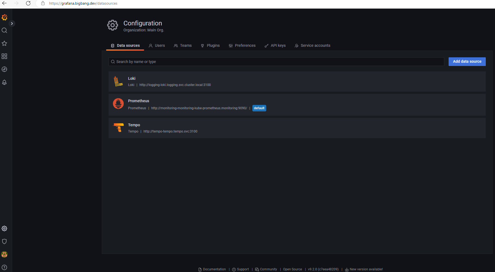
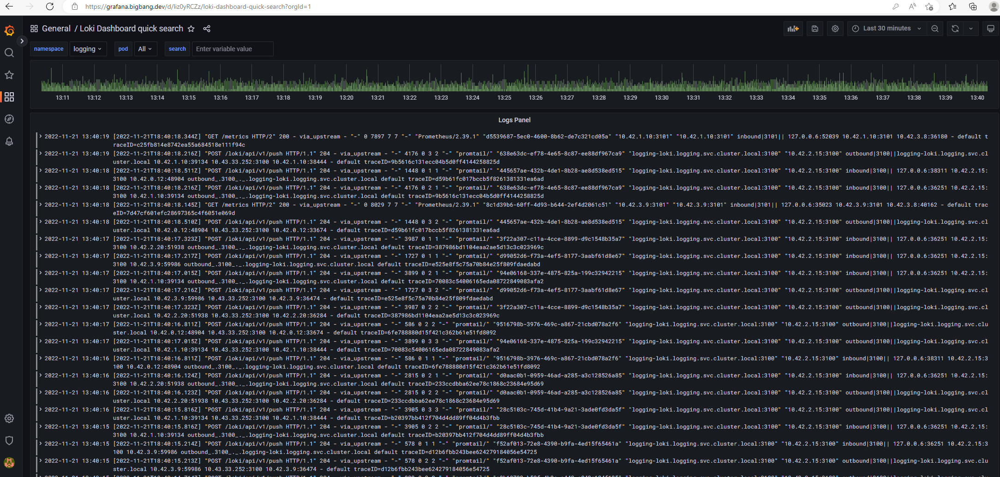

# Introduction to PLG stack - Prometheus, Loki and Grafana

### What is Prometheus

Prometheus is an open-source time-series database and alerting platform. To push metrics to Prometheus, you can either integrate your application with client library, or configure an existing exporters for a third-party application such as PostgreSQL. Prometheus collects and stores its metrics as time series data ( i.e. metrics information is stored with the timestamp at which it was recorded, alongside optional key-value pairs called labels) and it comes with basic visualization capability. Prometheus is a CNCF project since 2016 and is maintained by Grafana Labs. 

> For a detailed look at the [Package Architecture for Prometheus](https://docs-bigbang.dso.mil/latest/docs/understanding-bigbang/package-architecture/monitoring/)

### What is Loki

Loki is a horizontally scalable, highly available, multi-tenant log aggregation system inspired by Prometheus. It is designed to be very cost effective and easy to operate. It does not index the contents of the logs, but rather a set of labels for each log stream. You can use Grafana to consume the logs. Loki supports clients such as Fluentd, Fluentbit, Logstash, and Alloy. 

> For a detailed look at the [Package Architecture for Loki](https://docs-bigbang.dso.mil/latest/docs/understanding-bigbang/package-architecture/loki/)

### What is Grafana

Grafana is an open source interactive data-visualization platform, developed by Grafana Labs, which allows users to see their data via charts and graphs that are unified into one dashboard (or multiple dashboards!) for easier interpretation and understanding.

> For a detailed look at the [Package Architecture for Grafana](https://docs-bigbang.dso.mil/latest/docs/understanding-bigbang/package-architecture/monitoring/)

## Enable packages

> Note: Update to the latest Big Bang Tags

#### Example:

```yaml
loki:
  enabled: true
  git:
    repo: https://repo1.dso.mil/big-bang/product/packages/loki.git
    path: "./chart"
    tag: "5.41.4-bb.1"
```


## Grafana data-visualization



