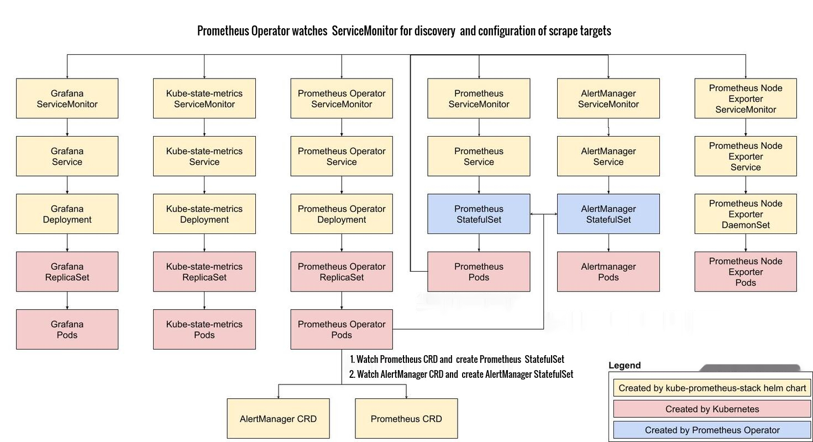

# Prometheus Operator Overview

The Prometheus Operator provides Kubernetes native deployment and management of Prometheus and related monitoring components. The purpose is to simplify and automate the configuration of a Prometheus based monitoring stack for Kubernetes clusters.

## Motivation

As explained in [Kubernetes Monitoring](kubernetes-monitoring.md), application workloads running as Pods need to be monitored in addition to monitoring the kubernetes cluster. This requires metrics collection from kubelet cAdvisor, node-exporter, kube-state-metrics , metrics-server and application Pods. A mechanism is needed not only to automate the deployment of the Prometheus stack, but also node-exporter, kube-state-metrics and metrics-server, but also dynamically configure Prometheus so that it can scrape the endpoints to collect metrics. This is achieved by deploying the [kube-prometheus-stack](https://github.com/prometheus-community/helm-charts/tree/main/charts/kube-prometheus-stack) helm chart that deploys the [kube-prometheus](https://github.com/prometheus-operator/kube-prometheus) project stack, that consists of Kubernetes manifests, Grafana dashboards, and Prometheus rules to provide easy to operate end-to-end Kubernetes cluster monitoring with Prometheus using the Prometheus Operator.

Prometheus Operator creates the Prometheus server based on user defined Prometheus CRD and achieves dynamic configuration of Prometheus server to scape application pod metrics endpoints by creating an instance of ServiceMonitor CRD mentioned later in this document and configuring its label selector to match that of the Prometheus CRD.

Prometheus Operator also makes it relatively easier for Prometheus to scale horizontally. Consider the use case where a cluster has a large number of applications deployed, and with each new application, new endpoints are scraped for metrics collection. This causes Prometheus to consume more memory and CPU for processing the metrics and would imply that resource limits and requests would continuously need to be adjusted based on observed usage. Rather than vertically scale Prometheus by allocating more resources, a better strategy is to provision horizontal scaling, and that is achieved by creating another instance of Prometheus CRD and creative use of label selector matching with the ServiceMonitor CRD so that the scraping is distributed between Prometheus servers.

## Overview of kube-prometheus-stack

The picture below summarizes workload resources created by kube-prometheus-stack deployment.

## Prometheus Operator Features

### Kubernetes Custom Resources

Use Kubernetes custom resources to deploy and manage Prometheus, Alertmanager, and related components.

### Simplified Deployment Configuration

Configure the fundamentals of Prometheus like versions, persistence, retention policies, and replicas from a native Kubernetes resource.

### Prometheus Target Configuration

Automatically generate monitoring target configurations based on familiar Kubernetes label queries; no need to learn a Prometheus specific configuration language.

## Prometheus Operator Stack Components

### Prometheus Server

Prometheus Server is the core component which performs monitoring. It scrapes and stores metrics. It consists of the following:

- the Retrieval - pulls metric data
- Time Series Database - stores metric data
- HTTP server - receives "promQL" queries

### Custom Resource Definitions

#### Prometheus

The Prometheus custom resource definition (CRD) declaratively defines a desired Prometheus setup to run in a Kubernetes cluster. It provides options to configure replication, persistent storage, and Alertmanagers to which the deployed Prometheus instances send alerts to.

[Refer to operator design document for interaction between the custom resource definitions](https://prometheus-operator.dev/docs/operator/design/)

#### Alertmanager

The Alertmanager custom resource definition (CRD) declaratively defines a desired Alertmanager setup to run in a Kubernetes cluster. It provides options to configure replication and persistent storage. For each Alertmanager resource, the Operator deploys a properly configured StatefulSet in the same namespace. The Alertmanager pods are configured to include a Secret called `<alertmanager-name>` which holds the used configuration file in the key alertmanager.yaml.

#### ThanosRuler

The ThanosRuler custom resource definition (CRD) declaratively defines a desired Thanos Ruler setup to run in a Kubernetes cluster. With Thanos Ruler recording and alerting rules can be processed across multiple Prometheus instances.

Further information can also be found in the Thanos doc.

#### ServiceMonitor

The ServiceMonitor custom resource definition (CRD) allows to declaratively define how a dynamic set of services should be monitored. Which services are selected to be monitored with the desired configuration is defined using label selections.  

For Prometheus to monitor any application within Kubernetes an Endpoints object needs to exist. Endpoints objects are essentially lists of IP addresses. Typically an Endpoints object is populated by a Service object. A Service object discovers Pods by a label selector and adds those to the Endpoints object.

#### Probe

The Probe custom resource definition (CRD) allows to declarative define how groups of ingresses and static targets should be monitored.

#### PrometheusRule

The PrometheusRule custom resource definition (CRD) declaratively defines a desired Prometheus rule to be consumed by one or more Prometheus instances. Alerts and recording rules can be saved and applied as YAML files, and dynamically loaded without requiring any restart.

Custom Resource Definitions or CRDs are used to generate configuration files and identify Prometheus resources.

### Prometheus Metric Exporters

Prometheus uses exporters to collect metrics from various sources:

- **Prometheus Self-Monitoring**: Prometheus exposes its own metrics at the `/metrics` endpoint, allowing you to monitor the health and performance of Prometheus itself.
- **Node Exporter DaemonSet**: Deployed as a DaemonSet to run on every node in the cluster, the node exporter collects hardware and OS-level metrics (CPU, memory, disk, network) and exposes them for Prometheus to scrape.
- **Sidecar Containers**: Applications that don't natively export Prometheus metrics can use sidecar containers (like redis-exporter for Redis) to translate application-specific metrics into Prometheus format.

### Prometheus Adapter

Prometheus Adapter enables Prometheus metrics to be used by Kubernetes' Horizontal Pod Autoscaler (HPA) and Vertical Pod Autoscaler (VPA). It implements the Kubernetes custom metrics API, allowing you to scale workloads based on any metric available in Prometheus, not just CPU and memory.

### Visualizations & Dashboards

Prometheus web UI

Prometheus web UI is graphical User Interface that enables users to view graphs, Prometheus configurations and rules, and endpoints.

### Alert Manager

AlertManager manages alerts received from the Prometheus server then routes them through the appropriate channel.

## Exposing Prometheus and Grafana to users

This guide explains, how Kubernetes Ingress can be setup, in order to expose the Prometheus, Alertmanager and Grafana UIs, that are included in the kube-prometheus project.

[UI Setup](https://prometheus-operator.dev/docs/exposing-prometheus-alertmanager-grafana-ingress/)

kube-prometheus ships with a set of default Prometheus rules and Grafana dashboards. At some point one might like to extend them, the purpose of this document is to explain how to do this.

[Prometheus Rules and Grafana Dashboards](https://prometheus-operator.dev/docs/developing-prometheus-rules-and-grafana-dashboards/)

## Prometheus with Thanos

Thanos is a set of components that can be composed into a highly available, multi Prometheus metric system with potentially unlimited storage capacity.

Before continuing with Prometheus Operator Thanos integration, it is recommended to read more about Thanos in the [documentation](https://thanos.io/tip/thanos/getting-started.md/).

The **Prometheus Operator** operates Prometheus and optionally ThanosRuler components. Other Thanos components, such as the querier and store gateway, must be configured separately. The Thanos system integrates with Prometheus by adding a Thanos sidecar to each Prometheus instance. The Thanos sidecar can be configured directly in the Prometheus CRD. This Sidecar can hook into the Thanos querying system as well as optionally back up your data in object storage.

## Additional links

The below links provide more resources to get to know the Prometheus Operator design and stack components:

- [Operator Design](https://prometheus-operator.dev/docs/operator/design/)
- [Prometheus Quickstart](https://prometheus-operator.dev/docs/prologue/quick-start/)
- [First Steps with Prometheus](https://prometheus.io/docs/introduction/first_steps/)
- [Alert Manager Configuration](https://prometheus.io/docs/alerting/latest/configuration/)
